### 数据

* 训练数据来自于 MNIST 数据集

训练集 55000 张
验证集 5000 张
测试集 10000 张

* 手写数字是采用画图板绘制，预测时，需要压缩到 28x28 的尺寸

| 类别 | \*.0                             | \*.1                             | \*.2                             |
|------|----------------------------------|----------------------------------|----------------------------------|
| 0    | 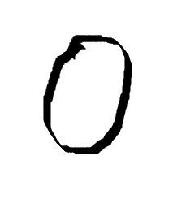   | 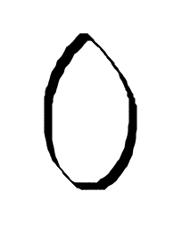 | 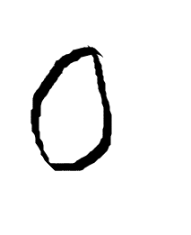 |
| 1    |    | 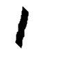 | 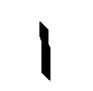 |
| 2    | 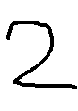   | 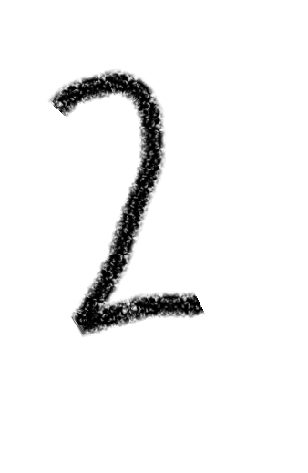 | 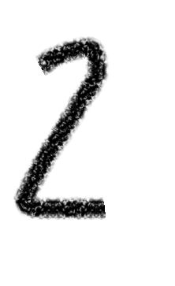 |
| 3    | 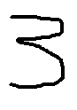   | 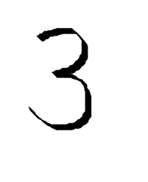 | 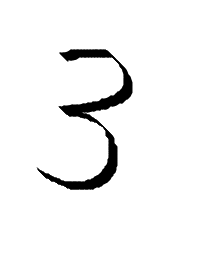 |
| 4    | 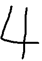   |  | 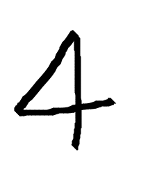 |
| 5    |    | 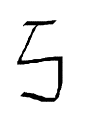 | 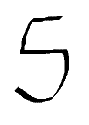 |
| 6    | 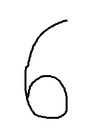   | 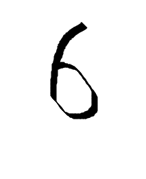 | 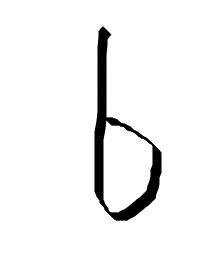 |
| 7    | 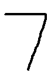   | 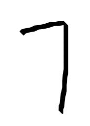 | 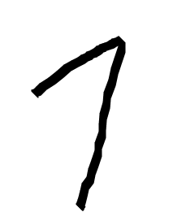 |
| 8    |    | 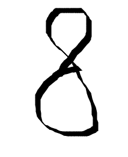 | 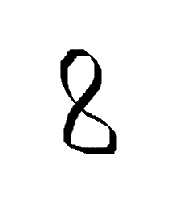 |
| 9    | 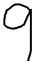   | 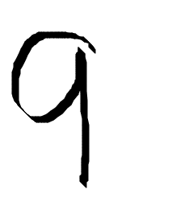 | 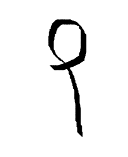 |

### [Keras 模型](keras)

采用 Kears 搭建 CNN 模型，在训练时，对 MNIST 数据集的数据进行了一定的随机变换（平移、旋转、噪音等），增加了数据的丰富性，提高训练模型的鲁棒性。

**训练**

```python
python3 train_mnist_keras.py
```

**预测手写数字**

```python
python3 predict_mnist_model.py --model 训练保存的模型
```

**10 轮训练**

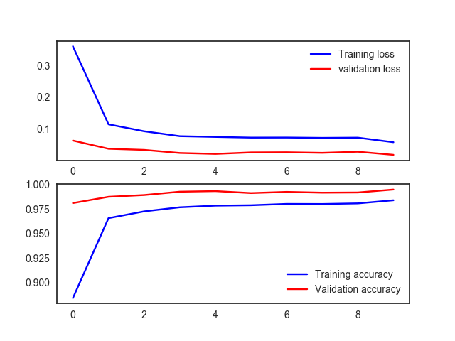

MNIST 测试集 test acc: 0.9957

```
0.0.png 0
0.1.png 0
0.2.png 9
1.0.png 1
1.1.png 1
1.2.png 1
2.0.png 2
2.1.png 2
2.2.png 2
3.0.png 3
3.1.png 3
3.2.png 3
4.0.png 4
4.1.png 4
4.2.png 4
5.0.png 5
5.1.png 5
5.2.png 5
6.0.png 5
6.1.png 1
6.2.png 6
7.0.png 7
7.1.png 7
7.2.png 7
8.0.png 8
8.1.png 8
8.2.png 1
9.0.png 9
9.1.png 9
9.2.png 9
```


**20 轮训练**

MNIST 测试集 test acc: 0.9922

```
0.1.png 0
0.2.png 0
0.png 0
1.1.png 1
1.2.png 1
1.png 1
2.1.png 1
2.2.png 1
2.png 2
3.1.png 3
3.2.png 1
3.png 3
4.1.png 4
4.2.png 4
4.png 4
5.1.png 5
5.2.png 5
5.png 5
6.1.png 1
6.2.png 6
6.png 0
7.1.png 7
7.2.png 7
7.png 7
8.1.png 8
8.2.png 8
8.png 8
9.1.png 9
9.2.png 9
9.png 9
```

**30 轮训练**

MNIST 测试集 test acc: 0.9952

```
0.0.png 0
0.1.png 0
0.2.png 9
1.0.png 1
1.1.png 1
1.2.png 1
2.0.png 2
2.1.png 1
2.2.png 2
3.0.png 3
3.1.png 3
3.2.png 3
4.0.png 4
4.1.png 4
4.2.png 4
5.0.png 5
5.1.png 5
5.2.png 5
6.0.png 1
6.1.png 5
6.2.png 6
7.0.png 7
7.1.png 7
7.2.png 7
8.0.png 8
8.1.png 8
8.2.png 2
9.0.png 9
9.1.png 9
9.2.png 9
```

**50 轮训练**

MNIST 测试集 test acc: 0.9959

```
0.0.png 0
0.1.png 0
0.2.png 9
1.0.png 1
1.1.png 1
1.2.png 1
2.0.png 2
2.1.png 2
2.2.png 2
3.0.png 3
3.1.png 3
3.2.png 9
4.0.png 4
4.1.png 4
4.2.png 4
5.0.png 5
5.1.png 5
5.2.png 5
6.0.png 0
6.1.png 1
6.2.png 6
7.0.png 7
7.1.png 7
7.2.png 7
8.0.png 8
8.1.png 8
8.2.png 0
9.0.png 9
9.1.png 9
9.2.png 9
```
