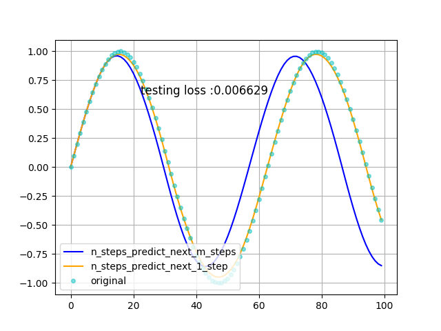

## 使用 Keras 搭建 RNN 模型，对正弦曲线进行拟合

* 使用正弦曲线上的前 n 个数据点，预测下一个数据点
* 训练数据有两种生成方式：1）随机截取正弦曲线上的 n+1 个数据，抽取指定样本数的数据点进行训练；2）顺序截取正弦曲线上的 n+1 个数据点，下一组训练数据时，向前推进一个点。

| [采样方法 1](RNN_fits_sine_curve_in_keras-lab-1.py) | [采样方法 2](RNN_fits_sine_curve_in_keras-lab-2.py) |
|:---------------------------------------------------:|:---------------------------------------------------:|
|   |   |
