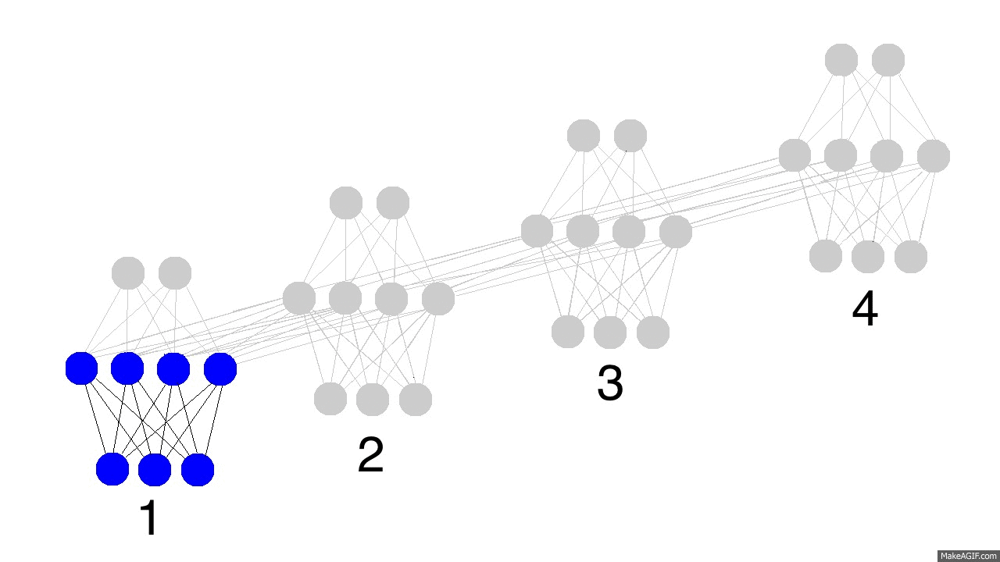
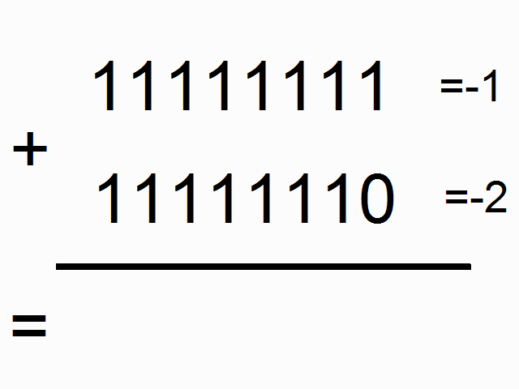

这是参照[人人都能用Python写出LSTM-RNN的代码！[你的神经网络学习最佳起步]](http://blog.csdn.net/zzukun/article/details/49968129) 的 RNN 学习案例。[英文原版](http://iamtrask.github.io/2015/11/15/anyone-can-code-lstm/)

## 一层隐藏层的 RNN 网络结构

**cell 单元结构**

* 输入层到隐藏层权重系数：SYNAPSE_0，常用的写法是 **U**
* 隐藏层到隐藏层权重系数：SYNAPSE_h，常用的写法是 **W**
* 隐藏层到输出层权重系数：SYNAPSE_1，常用的写法是 **V**

**正向传播**

上边的GIF图展现出循环神经网络的奥秘，以及一些非常、非常重要的性质。图中描述了4个时间步数，第一个仅仅受到输入数据的影响，第二个把第二个输入与第一个的隐含层混合，如此继续。有人可能会注意到，在这种方式下，第四个网络“满了”。这样推测的话，第五步不得不选择一个某个节点去替代掉它。是的，这很正确。这就是记忆的“容量”概念。正如你所期望的，更多的隐含层节点能够存储更多的记忆，并使记忆保持更长的时间。同样这也是网络学习去忘记无关的记忆并且记住重要的记忆。你在能从第三步中看出点什么不？为什么有更多的**绿色节点**呢？这是因为，记忆中的蓝色节点与红色节点混合，得到了绿色节点。

另外需要注意的是，隐含层是输入与输出中间的一道栅栏。事实上，输出已经不再是对应于输入的一个函数。**输入只是改变了记忆中存储的东西，而且输出仅仅依赖于记忆！**告诉你另外一个有趣的事情，如果上图中的第2,3,4步没有输入，随着时间的流逝，隐含层仍然会改变。这是因为，记忆在传递过程中，会不断的使用非线性的激活函数处理。

**时间反向传播（back-propagation through time，BPTT）**

看下面的图片，黑色的是预测，误差是亮黄色，导数是芥末色的（暗黄色）。网络通过从1到4的全部传播（通过任意长度的整个序列），然后从4到1反向传播所有的导数值。你也可以认为这仅仅是正常神经网络的一个有意思的变形，除了我们在各自的地方复用了相同的权值（突触synapses 0,1,h）。其他的地方都是很普通的反向传播。

## RNN 学习二进制加法

二进制加法从右边到左边进行计算，我们试图通过上边的数字，去预测横线下边的数字。我们想让神经网络遍历这个二进制序列并且记住它携带这个1与没有携带这个1的时候，这样的话网络就能进行正确的预测了。

[RNN 学习二进制加法玩具代码](RNN_learn_binary_addition.py)

[RNN 学习二进制加法（TensorFlow 实现）](RNN_learn_binary_addition_in_tensorflow.py)
