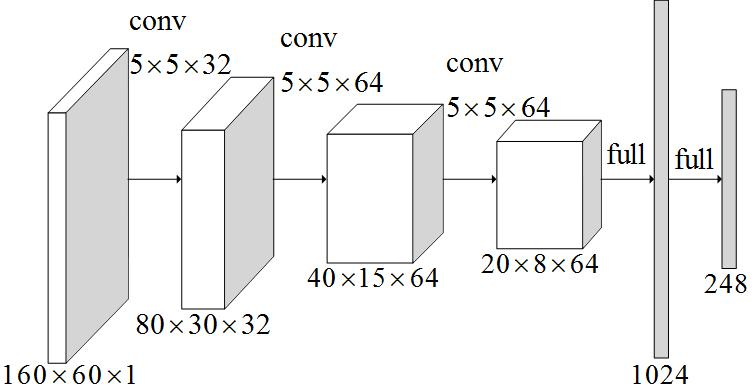
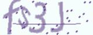
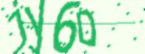
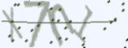

# CNN 识别验证码

目标是通过训练出一个对验证码识别率很高的模型，主要要点有：

* 使用 captcha 库生成数据集（需要提前使用 pip 安装），验证码是 4 位字符（10个数字、26 个小写字母和 26 个大写字母）的随机组合
* 使用 TensorFlow 搭建 CNN 模型

### CNN 模型

* [模型 1](captcha_model.py)




### 训练过程

```python
python3 train_captcha.py
```

如果有 GPU，经过 2~3 小时的训练，预测精度会超过 99%。训练结束后会保存学习好的模型。

### 预测

#### 生成预测样本

训练时，为了节省存储，并不会去保存验证码。预测时，需要先生成一些样本。

```python
python3 generate_captcha.py -N 10 --with_digit --img-path images
```

```
captcha is fs3J
captcha is W0qG
captcha is ZS2J
captcha is jy6D
captcha is 9Eae
captcha is 0flE
captcha is X7nl
captcha is rH5l
captcha is Kt6B
captcha is pH5V
```

```python
python3 generate_captcha.py --img-path images
```

```
0flE.jpg predict: 0flE
9Eae.jpg predict: 9Eae
fs3J.jpg predict: fs3J
jy6D.jpg predict: jy60
Kt6B.jpg predict: Kt6B
pH5V.jpg predict: pH5V
rH5l.jpg predict: rH5l
W0qG.jpg predict: W0qG
X7nl.jpg predict: X7nl
ZS2J.jpg predict: zS2J
```

|验证码               |预测|正确|
|---------------------|----|----|
| |0flE| √  |
| |9Eae| √  |
| |fs3J| √  |
| |jy60| X  |
| |Kt6B| √  |
| |pH5V| √  |
| |rH5l| √  |
| |W0qG| √  |
| |X7nl| √  |
| |X7nl| √  |
| |zS2J| X  |
